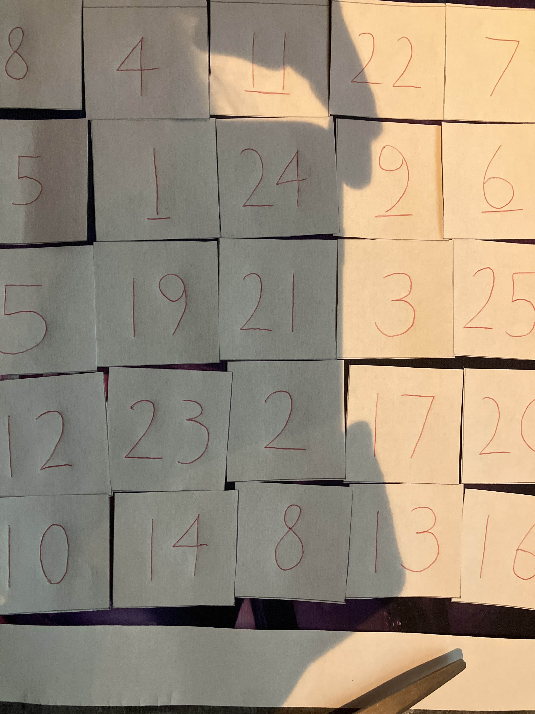
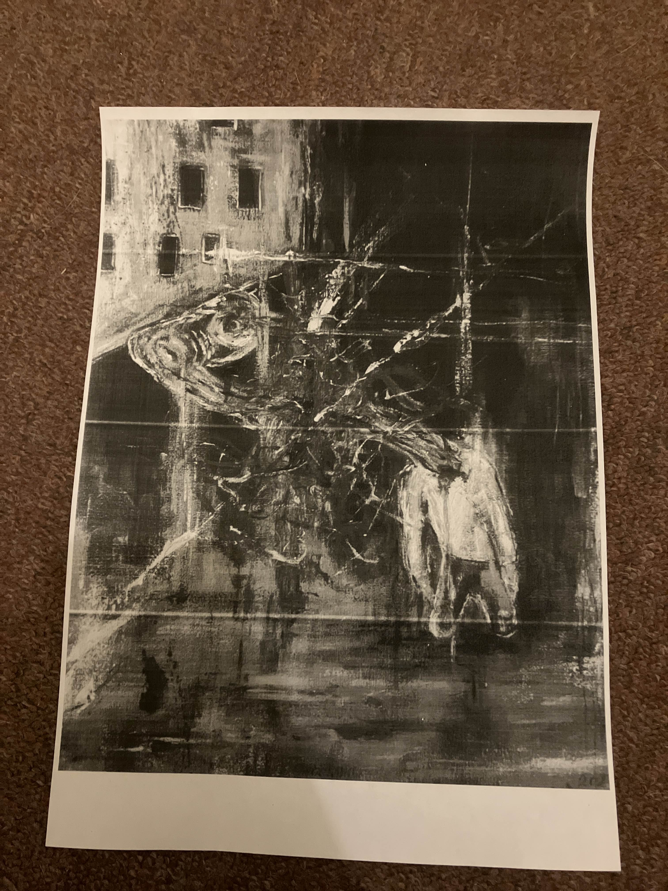

# Paper prototype

Onze paperprototype zal bestaan uit een puzzel waarbij 2 spelers moeten samenwerken om een correct eindresultaat te bereiken. Aan de hand van wiskundige berekeningen zal de narrator in staat zijn om de puzzelstukken correct te plaatsen om de puzzel te voltooien.

## Werking van de paper prototype

Voor de paper prototype zijn er 3 elementen die ervoor zorgen dat de puzzel tot een goed eidne gebracht kan worden.

### De puzzelstukjes

Het eerste element zijn de daadwerkelijke puzzelstukjes die gebruikt worden om de puzzel te maken. Elk van deze puzzelstukjes heeft een nummer op de achterzijde en deze worden gebruikt om de puzzelstukjes op de juiste plaats neer te leggen. het is belangrijk dat de speler niet kijkt naar de daadwerkelijke stukjes van de afbeelding, maar dat ze enkel kijken naar en werken met de achterkant van deze stukjes.

In samenwerking met de narrator (de persoon die de daadwerkelijke puzzelaar helpt met het plaatsen van de stukjes op de juiste plaats) zal de puzzelaar wiskundige berekeningen moeten zoeken die ervoor zorgen dat de stukjes een correcte plaats vinden voor het eindresultaat. Over de daadwerkelijke werking van deze berekeningen wordt nog meer informatie gegeven in [Het berekeningenblad](#Het-berekeningenblad)

### Het berekeningenblad

Het berekeningenblad bevat een rooster van verschillende getallen dat gebruikt wordt om de puzzelstukjes op de correcte plaats neer te leggen. Het berekeningenblad bevat een rooster waarbij elk vakje een unieke set van twee getallen (bijvoorbeeld A en B) bevat. De puzzelaar en narrator moeten samen ontdekken welk rekenteken ($+, -, \times, \div$) tussen A en B leidt tot het nummer op de achterkant van een puzzelstukje.

Als men vindt welke berekening hoort bij welk eindresultaat, dan kan de narrator aan de puzzelaar uitleggen waar hij het puzzelstukje moet neerzetten. De plaats waar dit puzzelstukje hoort, is gelijk aan de plaats die de berekening heeft op het berekeningenblad.

#### Voorbeeld

Een voorbeeld zal wellicht helpen om deze gamemechanic te verduidelijken.

Stel dat de puzzelaar een stukje wilt plaatsen waarop 56 staat op de achterkant. Dan zullen er op het berekeningenblad wellicht volgende sets van getallen staan.

1. 7, 8
2. 21, 35

Dit zijn beide mogelijke locaties op het rooster voor dit puzzelstuk, maar men zal moeten uitvogelen welke de juiste is. Dit zal zichzelf uitwijzen aangezien er wellicht een ander puzzelstukje is dat 15 heeft op de achterkant waardoor de (7, 8) set hierbij hoort (7 + 8) en de (21, 35) set bij de 56 hoort (21 + 35).

Er zal waarschijnlijk veel verschuiven van puzzelstukjes plaatsvinden doorheen het puzzelen. Het is de taak van de narrator om het plaatsen en het verplaatsen van de puzzelstukjes correct uit te leggen aan de hand van het berekeningenblad.

### De afbeelding

Het laatste item is de daadwerkelijke afbeelding die de puzzel zal tonen na het correct plaatsen van alle puzzelstukjes.

## Testdoeleinden van de paper prototype

Er is een kleine twist in het puzzelen waarvan de puzzelaar geen kennis mag hebben tijdens het samenwerken met de narrator. De uiteindelijke puzzel waartoe beide spelers werken zal uiteindelijk niet overeenkomen met de afbeelding, maar volledig scrambled zijn. De reden hiervoor is dat we willen testen hoe een speler zich zal voelen nadat ze samengewerkt hebben met een persoon waarvan ze denken dat deze goede bedoelingen heeft, die uiteindelijk de puzzelaar niet helpt, maar tot een slecht einde brengt.

In onze game willen we een unreliable narrator die ditzelfde gevoel opwekt bij de speler, maar uiteindelijke de "bad guy" is.

Het puzzel aspect van deze paper prototype toont de mechanic om je doorheen de uiteindelijke game te verplaatsen door verschillende puzzels op te lossen en uiteindelijk een eindresultaat te bereiken. Dit resultaat is dan zoals eerder gezegd gekoppeld aan verraad door de unreliable narrator.
